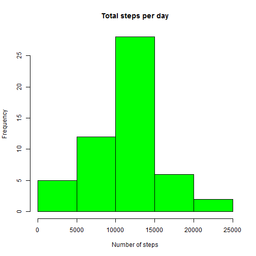
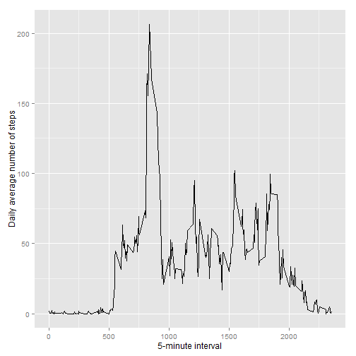
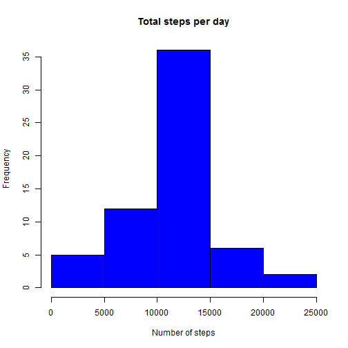

# Reproducible Research: Peer Assessment 1


## Loading and preprocessing the data


```r
unzip(zipfile = "c:/repdata-data-activity.zip")
```

```
## Warning in unzip(zipfile = "c:/repdata-data-activity.zip"): error 1 in
## extracting from zip file
```

```r
data = read.csv("c:/activity.csv")
```

## What is mean total number of steps taken per day?
Aggregate steps by day, plot Histogram, and calculate mean and median.


```r
steps_per_day = aggregate(steps ~ date, data, sum)
hist(steps_per_day$steps, main = paste("Total steps per day"), col = "green", xla = "Number of steps")
```

 


```r
r.mean = mean(steps_per_day$steps)
r.median = median(steps_per_day$steps)
```

```
## mean = 9354
## median = 10395
```

## What is the average daily activity pattern?


```r
library(ggplot2)

daily_average_by_interval = aggregate(x = list(steps = data$steps), by = list(interval = data$interval), FUN = mean, na.rm = TRUE)

ggplot(data = daily_average_by_interval, aes(x = interval, y = steps)) + geom_line() + xlab("5-minute interval") + ylab("Daily average number of steps")
```

 


```r
max_interval <- daily_average_by_interval[which.max(daily_average_by_interval$steps),1]
```

The 5-minute interval, on average across all the days in the data set, containing the maximum number of steps is 835.


```r
missing = is.na(data$steps)
table(missing)
```

```
## missing
## FALSE  TRUE 
## 15264  2304
```

Missing values were replaced by the average for each interval.


```r
# Replace each missing value with the mean value of the 5-minute interval
replace.value= function(steps, interval) {
    replace = NA
    if (!is.na(steps)) { 
        replace = c(steps) } else { replace = (daily_average_by_interval[daily_average_by_interval$interval == interval, "steps"])}
    return(replace)
}
replace.data = data
replace.data$steps = mapply(replace.value, replace.data$steps, replace.data$interval)
```

Then, using the new data set to plot a histogram of the total number of steps taken per day and calculate the mean and median total number of steps.


```r
daily.total.steps = tapply(replace.data$steps, replace.data$date, FUN = sum)
hist(daily.total.steps, main = paste("Total steps per day"), col="blue", xlab="Number of steps")
```

 

Calculate new mean and median. 


```r
r.mean.new = mean(daily.total.steps)
r.median.new = median(daily.total.steps)
print(paste('new mean:', r.mean.new, "&", 'new med:', r.median.new))
```

```
## [1] "new mean: 10766.1886792453 & new med: 10766.1886792453"
```

Calculate difference between the new and original data sets.


```r
mean_diff = r.mean.new - r.mean
med_diff = r.median.new - r.median
print(paste('mean diff:', mean_diff, "&", 'med diff:', med_diff))
```

```
## [1] "mean diff: 0 & med diff: 1.1886792452824"
```

Calculate total difference.


```r
total_diff = sum(daily.total.steps) - sum(steps_per_day$steps)
print(paste('total diff:', total_diff))
```

```
## [1] "total diff: 86129.5094339623"
```

## Are there differences in activity patterns between weekdays and weekends?

Made a plot to compare the number of steps between the week and weekend.  


```r
library(lattice)

weekdays = c("Monday", "Tuesday", "Wednesday", "Thursday", "Friday")

replace.data$dow = as.factor(ifelse(is.element(weekdays(as.Date(replace.data$date)),weekdays), "Weekday", "Weekend"))

steps_by_interval = aggregate(steps ~ interval + dow, replace.data, mean)

xyplot(steps_by_interval$steps ~ steps_by_interval$interval|steps_by_interval$dow, main="Average steps per day by interval", xlab="Interval", ylab="Steps",layout=c(1,2), type="l")
```

 
